# README for AI Agent: Cursor-Figma MCP Setup Guide

## 🤖 AI Agent Decision Flow

```mermaid
flowchart TD
    A[Start Setup] --> B{System Check}
    B -->|✅ Pass| C{Admin Access?}
    B -->|❌ Failed| Z[❌ Fix Prerequisites]
    
    C -->|✅ Yes| D[Method A: Full Install<br/>Homebrew + Bun]
    C -->|❌ No| E[Method B: Cursor-Only<br/>No System Changes]
    
    D --> F[Clone in Cursor]
    E --> F
    
    F --> G[Configure MCP]
    G --> H{MCP Connected?}
    H -->|✅ Yes| I[Start WebSocket]
    H -->|❌ No| J[Debug & Retry]
    
    I --> K[Install Figma Plugin]
    K --> L[Test Integration]
    L --> M[✅ Complete]
    
    J --> H
```

## 🎯 Objective

Install and configure Cursor-Figma MCP integration with **AI-agent-friendly decision trees** and fail-safe checkpoints at each step. This guide uses Cursor's built-in Git clone functionality to directly clone the official repository, simplifying the setup process.

### 🤖 For AI Agents Reading This Guide

This guide is **specifically designed for AI agents** to understand, parse, and execute setup instructions autonomously. Each section includes:

- **Clear boolean decision points** for branching logic
- **Explicit command verification steps** with expected outputs  
- **Fallback strategies** when primary methods fail
- **Environment-specific instructions** based on system capabilities
- **Checkpoint validations** before proceeding to next steps

**AI Agent Instructions**: 
1. Execute each command and verify the expected output
2. Follow the branching logic based on system environment
3. If any step fails, use the provided fallback methods
4. Always validate checkpoints before continuing
5. **CRITICAL**: Create and update visual progress tracking using Mermaid diagrams at each major checkpoint

## 📋 System Environment Detection

**CRITICAL FOR AI AGENTS**: Execute these detection commands and use results for branching decisions.

```bash
# System Detection Commands - Execute ALL and store results
echo "=== SYSTEM ENVIRONMENT DETECTION ==="

# 1. Operating System Check
OS_TYPE=$(uname -s)
echo "OS_TYPE: $OS_TYPE"

# 2. Shell Type Detection  
echo "SHELL_TYPE: $SHELL"

# 3. Homebrew Availability
HOMEBREW_AVAILABLE=$(which brew >/dev/null 2>&1 && echo "YES" || echo "NO")
echo "HOMEBREW_AVAILABLE: $HOMEBREW_AVAILABLE"

# 4. Node.js Availability
NODE_AVAILABLE=$(which node >/dev/null 2>&1 && echo "YES" || echo "NO")
if [ "$NODE_AVAILABLE" = "YES" ]; then
    NODE_VERSION=$(node --version 2>/dev/null || echo "UNKNOWN")
    echo "NODE_VERSION: $NODE_VERSION"
fi

# 5. Bun Availability
BUN_AVAILABLE=$(which bun >/dev/null 2>&1 && echo "YES" || echo "NO")
if [ "$BUN_AVAILABLE" = "YES" ]; then
    BUN_VERSION=$(bun --version 2>/dev/null || echo "UNKNOWN")
    echo "BUN_VERSION: $BUN_VERSION"
fi

# 6. Cursor IDE Availability
CURSOR_AVAILABLE=$(which cursor >/dev/null 2>&1 && echo "YES" || echo "NO")
echo "CURSOR_AVAILABLE: $CURSOR_AVAILABLE"

# 7. Git Availability
GIT_AVAILABLE=$(which git >/dev/null 2>&1 && echo "YES" || echo "NO")
if [ "$GIT_AVAILABLE" = "YES" ]; then
    GIT_VERSION=$(git --version 2>/dev/null || echo "UNKNOWN")
    echo "GIT_VERSION: $GIT_VERSION"
fi

# 8. Admin/Sudo Access Check
SUDO_AVAILABLE=$(sudo -n true 2>/dev/null && echo "YES" || echo "NO")
echo "SUDO_AVAILABLE: $SUDO_AVAILABLE"

echo "=== DETECTION COMPLETE ==="
```

## 📊 AI Agent Progress Tracking Templates

**MANDATORY FOR AI AGENTS**: Use these Mermaid templates to show progress at each checkpoint.

### 🎯 Progress Status Template

Use these exact status indicators:
- ✅ **COMPLETED** - Step finished successfully
- 🔄 **CURRENT** - Currently executing this step  
- ⏳ **PENDING** - Not started yet
- ❌ **FAILED** - Step failed, needs attention
- ⚠️ **WARNING** - Step completed with warnings

### 📋 Standard Progress Tracking Template

**AI AGENTS MUST CREATE THIS DIAGRAM** after environment detection and update it at each checkpoint:

```mermaid
graph TD
    A[🔍 Environment Detection] --> B[📦 Method Selection]
    B --> C[⚡ Dependency Installation] 
    C --> D[⚙️ MCP setup and configuration]
    D --> E[🌐 WebSocket Server]
    E --> F[🔌 Figma Plugin]
    F --> G[🧪 Integration Test]
    G --> H[✅ Setup Complete]
    
    classDef completed fill:#22c55e,stroke:#16a34a,stroke-width:2px,color:#fff
    classDef current fill:#3b82f6,stroke:#2563eb,stroke-width:2px,color:#fff
    classDef pending fill:#6b7280,stroke:#4b5563,stroke-width:2px,color:#fff
    classDef failed fill:#ef4444,stroke:#dc2626,stroke-width:2px,color:#fff
    classDef warning fill:#f59e0b,stroke:#d97706,stroke-width:2px,color:#fff
```

### 🎨 How to Update Progress Status

**AI Agents must use this exact format** at each checkpoint:

```
## 📊 Current Progress Status

```mermaid
graph TD
    A[🔍 Environment Detection] --> B[📦 Method Selection]
    B --> C[⚡ Dependency Installation] 
    C --> D[⚙️ MCP setup and configuration]
    D --> E[🌐 WebSocket Server]
    E --> F[🔌 Figma Plugin]
    F --> G[🧪 Integration Test]
    G --> H[✅ Setup Complete]
    
    class A completed
    class B current
    class C,D,E,F,G,H pending
    
    classDef completed fill:#22c55e,stroke:#16a34a,stroke-width:2px,color:#fff
    classDef current fill:#3b82f6,stroke:#2563eb,stroke-width:2px,color:#fff
    classDef pending fill:#6b7280,stroke:#4b5563,stroke-width:2px,color:#fff
    classDef failed fill:#ef4444,stroke:#dc2626,stroke-width:2px,color:#fff
    classDef warning fill:#f59e0b,stroke:#d97706,stroke-width:2px,color:#fff
```


### 🛠️ Method-Specific Progress Templates

#### For Method A (Full Installation):
```mermaid
graph LR
    A1[🍺 Homebrew Check] --> A2[📦 Install Dependencies]
    A2 --> A3[⚙️ MCP Setup]  
    A3 --> A4[✅ Ready for WebSocket]
```

#### For Method B (Cursor-Only):
```mermaid
graph LR
    B1[🖥️ Project Already Open] --> B2[📖 Setup Dependencies]
    B2 --> B3[⚙️ MCP Setup] 
    B3 --> B4[✅ Ready for WebSocket]
```

### 📍 Mandatory Progress Update Points

**AI Agents MUST update progress diagram at these checkpoints:**

1. **After Environment Detection** (Step 1)
2. **After Method Selection** (Step 2)  
3. **After Dependency Installation** (Step 3)
4. **After MCP Setup and Configuration** (Step 4)
5. **After WebSocket Start** (Step 5)
6. **After Figma Plugin Install** (Step 6)
7. **After Integration Test** (Step 7)
8. **Final Completion** (Step 8)

### 🤖 AI Agent Progress Update Commands

**Use these exact commands at each checkpoint:**

```
CHECKPOINT [STEP_NUMBER]: [STEP_NAME]

Please create/update the progress tracking diagram to show:
- Current step: [STEP_NAME] 
- Status: [✅ COMPLETED / 🔄 CURRENT / ❌ FAILED]
- Next step: [NEXT_STEP_NAME]
- Any warnings or issues encountered

Update the Mermaid diagram with appropriate class assignments and show the overall progress percentage.
```

### 🤖 AI Agent Decision Logic

Based on the detection results above, AI agents should follow this decision tree:

```bash
# AI Agent Decision Variables (set based on detection above)
HOMEBREW_AVAILABLE="YES"  # or "NO"
NODE_AVAILABLE="YES"      # or "NO" 
BUN_AVAILABLE="YES"       # or "NO"
CURSOR_AVAILABLE="YES"    # or "NO"
SUDO_AVAILABLE="YES"      # or "NO"
```

**Decision Tree**:
- IF `HOMEBREW_AVAILABLE="YES"` AND `SUDO_AVAILABLE="YES"` → **Method A1: Homebrew Installation**
- ELIF `SUDO_AVAILABLE="YES"` AND `HOMEBREW_AVAILABLE="NO"` → **Method A2: Direct Installation**  
- ELIF `CURSOR_AVAILABLE="YES"` AND `SUDO_AVAILABLE="NO"` → **Method B: Cursor-Only Setup**
- ELSE → **Error: Insufficient System Access**

## 🛡️ Method Selection Based on Environment

### 🌟 Method A1: Homebrew Installation (Recommended)
**Conditions**: `HOMEBREW_AVAILABLE="YES"` AND `SUDO_AVAILABLE="YES"`
- Uses Homebrew package manager
- Cleanest dependency management
- Best for macOS systems with Homebrew

### 🔧 Method A2: Direct Installation  
**Conditions**: `SUDO_AVAILABLE="YES"` AND `HOMEBREW_AVAILABLE="NO"`
- Direct installation without package manager
- For systems without Homebrew but with admin access
- Manual dependency management

### 📱 Method B: Cursor-Only Setup
**Conditions**: `CURSOR_AVAILABLE="YES"` AND `SUDO_AVAILABLE="NO"`
- No system-wide installations
- Uses Cursor's built-in capabilities
- For restricted environments

---

## 🚀 Method A1: Homebrew Installation

### 📊 Progress Tracking for Method A1

**AI AGENTS**: Start by creating initial progress diagram:

```
CHECKPOINT 1: STARTING METHOD A1 - HOMEBREW INSTALLATION

Please create the Method A1 progress tracking diagram:

```mermaid
graph TD
    A[🔍 Environment Detection] --> B[📦 Method A1 Selected]
    B --> C[🍺 Homebrew Check] 
    C --> D[📦 Install Dependencies]
    D --> E[⚙️ MCP Setup]
    E --> F[🚀 Ready for WebSocket]
    
    class A completed
    class B current
    class C,D,E,F pending
    
    classDef completed fill:#22c55e,stroke:#16a34a,stroke-width:2px,color:#fff
    classDef current fill:#3b82f6,stroke:#2563eb,stroke-width:2px,color:#fff
    classDef pending fill:#6b7280,stroke:#4b5563,stroke-width:2px,color:#fff
```
```

### Prerequisites Check for Method A1
```bash
# Verify Homebrew functionality
brew --version && echo "✅ Homebrew functional" || echo "❌ ERROR: Homebrew broken"

# Check brew permissions
brew doctor && echo "✅ Homebrew healthy" || echo "⚠️ WARNING: Homebrew has issues"
```

### Step A1.1: Install Dependencies via Homebrew

```bash
# Update Homebrew first
brew update

# Install Node.js if not available
if [ "$NODE_AVAILABLE" = "NO" ]; then
    echo "Installing Node.js via Homebrew..."
    brew install node
    NODE_AVAILABLE="YES"
    NODE_VERSION=$(node --version)
    echo "✅ Node.js installed: $NODE_VERSION"
else
    echo "✅ Node.js already available: $NODE_VERSION"
fi

# Install Bun if not available  
if [ "$BUN_AVAILABLE" = "NO" ]; then
    echo "Installing Bun via Homebrew..."
    brew install bun
    BUN_AVAILABLE="YES"
    BUN_VERSION=$(bun --version)
    echo "✅ Bun installed: $BUN_VERSION"
else
    echo "✅ Bun already available: $BUN_VERSION"
fi

# Verify installations
echo "=== DEPENDENCY VERIFICATION ==="
node --version && echo "✅ Node.js working"
bun --version && echo "✅ Bun working"  
git --version && echo "✅ Git working"
which cursor && echo "✅ Cursor available" || echo "❌ Install Cursor IDE manually"
```

**CHECKPOINT A1.1**: All dependencies must show ✅ before proceeding.

**AI AGENTS**: Update progress after dependency installation:

```
CHECKPOINT 2: DEPENDENCIES INSTALLED

Update Method A1 progress - mark Homebrew Check and Dependencies as completed:

```mermaid
graph TD
    A[🔍 Environment Detection] --> B[📦 Method A1 Selected]
    B --> C[🍺 Homebrew Check] 
    C --> D[📦 Install Dependencies]
    D --> E[⚙️ MCP Setup]
    E --> F[🚀 Ready for WebSocket]
    
    class A,B,C,D completed
    class E current
    class F pending
    
    classDef completed fill:#22c55e,stroke:#16a34a,stroke-width:2px,color:#fff
    classDef current fill:#3b82f6,stroke:#2563eb,stroke-width:2px,color:#fff
    classDef pending fill:#6b7280,stroke:#4b5563,stroke-width:2px,color:#fff
```
```

### Step A1.2: MCP Setup via Homebrew Method

**🎯 Project is already cloned and open in Cursor IDE**

1. **Verify project structure**:

```bash
# Verify current directory (should already be in cursor-talk-to-figma-mcp)
pwd | grep "cursor-talk-to-figma-mcp" && echo "✅ Correct directory" || echo "❌ ERROR: Wrong directory"

# Verify project structure
ls package.json src && echo "✅ Project structure valid" || echo "❌ ERROR: Invalid project structure"

# Install dependencies and setup
bun install
bun run build

# Run setup (this configures MCP automatically)
bun setup && echo "✅ Setup complete" || echo "❌ ERROR: Setup failed"

# Verify MCP config was created
test -f .cursor/mcp.json && echo "✅ MCP config created" || echo "❌ ERROR: MCP config missing"
```

**AI AGENTS**: Update progress after Method A1 completion:

```
CHECKPOINT 3: METHOD A1 COMPLETE

Method A1 fully completed, ready for common steps:

```mermaid
graph TD
    A[🔍 Environment Detection] --> B[📦 Method A1 Selected]
    B --> C[🍺 Homebrew Check] 
    C --> D[📦 Install Dependencies]
    D --> E[⚙️ MCP Setup]
    E --> F[🚀 Ready for WebSocket]
    
    class A,B,C,D,E,F completed
    
    classDef completed fill:#22c55e,stroke:#16a34a,stroke-width:2px,color:#fff
```

Progress: Method A1 100% Complete ✅ - Proceeding to Common Steps
```

**Continue to Common Steps below.**

---

## 🔧 Method A2: Direct Installation

### 📊 Progress Tracking for Method A2

**AI AGENTS**: Start by creating Method A2 progress diagram:

```
CHECKPOINT 1: STARTING METHOD A2 - DIRECT INSTALLATION

Please create the Method A2 progress tracking diagram:

```mermaid
graph TD
    A[🔍 Environment Detection] --> B[📦 Method A2 Selected]
    B --> C[⚡ Install Bun Direct] 
    C --> D[⚙️ MCP Setup]
    D --> E[🚀 Ready for WebSocket]
    
    class A completed
    class B current
    class C,D,E pending
    
    classDef completed fill:#22c55e,stroke:#16a34a,stroke-width:2px,color:#fff
    classDef current fill:#3b82f6,stroke:#2563eb,stroke-width:2px,color:#fff
    classDef pending fill:#6b7280,stroke:#4b5563,stroke-width:2px,color:#fff
```
```

### Prerequisites Check for Method A2
```bash
# Verify we have sudo access but no Homebrew
[ "$SUDO_AVAILABLE" = "YES" ] && echo "✅ Sudo access confirmed" || exit 1
[ "$HOMEBREW_AVAILABLE" = "NO" ] && echo "✅ Direct installation path confirmed" || echo "⚠️ Homebrew available, consider Method A1"
```

### Step A2.1: Install Bun Directly

```bash
# Install Bun directly (requires internet access)
curl -fsSL https://bun.sh/install | bash

# Reload shell environment 
if [[ "$SHELL" == *"zsh"* ]]; then
    source ~/.zshrc 2>/dev/null || echo "⚠️ No .zshrc found"
    echo "🐚 Using Zsh shell"
elif [[ "$SHELL" == *"bash"* ]]; then
    source ~/.bashrc 2>/dev/null || source ~/.bash_profile 2>/dev/null || echo "⚠️ No .bashrc or .bash_profile found"
    echo "🐚 Using Bash shell"
fi

# Verify installation
bun --version && echo "✅ Bun installed successfully" || echo "❌ ERROR: Bun installation failed"
BUN_AVAILABLE="YES"
BUN_VERSION=$(bun --version)
```

**AI AGENTS**: Update progress after Bun installation:

```
CHECKPOINT 2: BUN INSTALLED DIRECTLY

Update Method A2 progress - Bun installation completed:

```mermaid
graph TD
    A[🔍 Environment Detection] --> B[📦 Method A2 Selected]
    B --> C[⚡ Install Bun Direct] 
    C --> D[⚙️ MCP Setup]
    D --> E[🚀 Ready for WebSocket]
    
    class A,B,C completed
    class D current
    class E pending
    
    classDef completed fill:#22c55e,stroke:#16a34a,stroke-width:2px,color:#fff
    classDef current fill:#3b82f6,stroke:#2563eb,stroke-width:2px,color:#fff
    classDef pending fill:#6b7280,stroke:#4b5563,stroke-width:2px,color:#fff
```
```

### Step A2.2: MCP Setup via Direct Method

**🎯 Project is already cloned and open in Cursor IDE**

1. **Verify project setup**:

```bash
# Verify current directory (should already be in cursor-talk-to-figma-mcp)
pwd | grep "cursor-talk-to-figma-mcp" && echo "✅ Correct directory" || echo "❌ ERROR: Wrong directory"

# Verify and setup
ls package.json src && echo "✅ Project structure valid" || echo "❌ ERROR: Invalid project structure"
bun install
bun run build
bun setup && echo "✅ Setup complete" || echo "❌ ERROR: Setup failed"
test -f .cursor/mcp.json && echo "✅ MCP config created" || echo "❌ ERROR: MCP config missing"
```

**AI AGENTS**: Update progress after Method A2 completion:

```
CHECKPOINT 3: METHOD A2 COMPLETE

Method A2 fully completed, ready for common steps:

```mermaid
graph TD
    A[🔍 Environment Detection] --> B[📦 Method A2 Selected]
    B --> C[⚡ Install Bun Direct] 
    C --> D[⚙️ MCP Setup]
    D --> E[🚀 Ready for WebSocket]
    
    class A,B,C,D,E completed
    
    classDef completed fill:#22c55e,stroke:#16a34a,stroke-width:2px,color:#fff
```

Progress: Method A2 100% Complete ✅ - Proceeding to Common Steps
```

**Continue to Common Steps below.**

---

## 📱 Method B: Cursor-Only Setup

### 📊 Progress Tracking for Method B

**AI AGENTS**: Start by creating Method B progress diagram:

```
CHECKPOINT 1: STARTING METHOD B - CURSOR-ONLY SETUP

Please create the Method B progress tracking diagram:

```mermaid
graph TD
    A[🔍 Environment Detection] --> B[📦 Method B Selected]
    B --> C[🖥️ Project Already Open] 
    C --> D[📖 Setup Dependencies]
    D --> E[⚙️ MCP Setup]
    E --> F[🚀 Ready for WebSocket]
    
    class A completed
    class B current
    class C,D,E,F pending
    
    classDef completed fill:#22c55e,stroke:#16a34a,stroke-width:2px,color:#fff
    classDef current fill:#3b82f6,stroke:#2563eb,stroke-width:2px,color:#fff
    classDef pending fill:#6b7280,stroke:#4b5563,stroke-width:2px,color:#fff
```
```

### Prerequisites Check for Method B
```bash
# Verify Cursor-only setup conditions
[ "$CURSOR_AVAILABLE" = "YES" ] && echo "✅ Cursor IDE available" || echo "❌ ERROR: Install Cursor IDE first"
[ "$SUDO_AVAILABLE" = "NO" ] && echo "✅ Restricted environment confirmed" || echo "⚠️ Admin access available, consider Method A"
```

### Step B.1: Verify Project is Open in Cursor

**🎯 Project is already cloned and open in Cursor IDE**

1. **Verify project is properly loaded**:
   - Confirm Cursor IDE has the project open
   - Open terminal in Cursor: `Terminal > New Terminal` (or `Ctrl+Shift+`)

### Step B.2: Setup Dependencies in Cursor

```bash
# Verify current directory (should already be in cursor-talk-to-figma-mcp)
pwd | grep "cursor-talk-to-figma-mcp" && echo "✅ Correct directory" || echo "❌ ERROR: Wrong directory"

# Verify project structure
ls package.json src && echo "✅ Project structure valid" || echo "❌ ERROR: Invalid project structure"
```

**AI AGENTS**: Update progress after project cloning:

```
CHECKPOINT 2: PROJECT CLONED IN CURSOR

Update Method B progress - project cloned successfully:

```mermaid
graph TD
    A[🔍 Environment Detection] --> B[📦 Method B Selected]
    B --> C[🖥️ Project Already Open] 
    C --> D[📖 Setup Dependencies]
    D --> E[⚙️ MCP Setup]
    E --> F[🚀 Ready for WebSocket]
    
    class A,B,C,D completed
    class E current
    class F pending
    
    classDef completed fill:#22c55e,stroke:#16a34a,stroke-width:2px,color:#fff
    classDef current fill:#3b82f6,stroke:#2563eb,stroke-width:2px,color:#fff
    classDef pending fill:#6b7280,stroke:#4b5563,stroke-width:2px,color:#fff
```
```

### Step B.3: Follow README Setup in Cursor

**📖 CRITICAL FOR AI AGENTS**: Ask the AI assistant in Cursor to read and execute the README:

```
Please read the @readme.md file and help me set up this project by following the installation instructions step by step.

IMPORTANT: For each step in the setup process, please:
1. Create a Mermaid flowchart showing the complete installation process
2. Highlight which step we're currently on  
3. Show what steps are completed, current, and upcoming
4. Include brief descriptions of what each step does
5. Update the diagram as we progress through each step

Use this Mermaid template structure:
- Use different colors/styles to show: ✅ Completed, 🔄 Current, ⏳ Upcoming  
- Include step numbers and brief descriptions
- Show the flow from Prerequisites → Installation → Configuration → Testing
- Make it visually clear where we are in the process

This will help track overall progress and determine next steps at each stage.
```

**AI AGENTS**: Update progress after Method B completion:

```
CHECKPOINT 3: METHOD B COMPLETE

Method B fully completed, ready for common steps:

```mermaid
graph TD
    A[🔍 Environment Detection] --> B[📦 Method B Selected]
    B --> C[🖥️ Project Already Open] 
    C --> D[📖 Setup Dependencies]
    D --> E[⚙️ MCP Setup]
    E --> F[🚀 Ready for WebSocket]
    
    class A,B,C,D,E,F completed
    
    classDef completed fill:#22c55e,stroke:#16a34a,stroke-width:2px,color:#fff
```

Progress: Method B 100% Complete ✅ - Proceeding to Common Steps
```

**Continue to Common Steps below.**

---

## 🔗 Common Steps (All Methods)

### Step C.1: Verify MCP Configuration

**🚨 CRITICAL FOR AI AGENTS**: Project is already cloned and open in Cursor.

```bash
# Verify current directory (should already be in cursor-talk-to-figma-mcp)
pwd | grep "cursor-talk-to-figma-mcp" && echo "✅ Correct directory" || echo "❌ ERROR: Wrong directory"

# Verify project structure
ls package.json src && echo "✅ Project structure valid" || echo "❌ ERROR: Invalid project structure"

# Verify MCP config exists (created by bun setup)
if [ -f ".cursor/mcp.json" ]; then
    echo "✅ MCP config found"
else
    echo "⚠️ MCP config not found - running setup..."
    bun setup
fi

echo "✅ Project verified - MCP should be configured"
```

**CHECKPOINT C.1**: Verify in Cursor:
1. Open Settings (`Cmd+,` on Mac, `Ctrl+,` on Windows/Linux)
2. Search "MCP"  
3. Confirm "TalkToFigma" shows as "Connected"

**AI AGENTS**: Update overall progress after Cursor launch:

```
CHECKPOINT 3: MCP SETUP AND CONFIGURATION COMPLETE

Update overall progress - MCP setup and configured:

```mermaid
graph TD
    A[🔍 Environment Detection] --> B[📦 Method Selection]
    B --> C[⚡ Dependency Installation] 
    C --> D[⚙️ MCP setup and configuration]
    D --> E[🌐 WebSocket Server]
    E --> F[🔌 Figma Plugin]
    F --> G[🧪 Integration Test]
    G --> H[✅ Setup Complete]
    
    class A,B,C,D completed
    class E current
    class F,G,H pending
    
    classDef completed fill:#22c55e,stroke:#16a34a,stroke-width:2px,color:#fff
    classDef current fill:#3b82f6,stroke:#2563eb,stroke-width:2px,color:#fff
    classDef pending fill:#6b7280,stroke:#4b5563,stroke-width:2px,color:#fff
```

Progress: 50% Complete - MCP Configured ✅ - Starting WebSocket Server
```

### Step C.2: Start WebSocket Server

To ensure stability and easy monitoring, we will run the WebSocket server in the foreground. This is the recommended method as it dedicates a terminal to the server, confirming it's always running, and saves all logs to a file for later review.

**How to Start and Monitor the Server:**

1.  **Start the Server**: Open a new terminal in Cursor and run the following command. The terminal will become unresponsive, which means the server is running correctly.
    ```bash
    # Runs the server in the foreground and saves all logs to websocket.log
    bun socket > websocket.log 2>&1
    ```

2.  **Monitor Logs**: To see server activity, open a *second* terminal and use this command for a live feed of the logs:
    ```bash
    tail -f websocket.log
    ```
    You can also simply open the `websocket.log` file to view its contents.

3.  **Stop the Server**: To stop the server, go to its dedicated terminal window and press `Ctrl + C`.

**CHECKPOINT C.2**: The server terminal should be active (and unresponsive). You should see a "WebSocket server running on port 3055" message at the beginning of the `websocket.log` file. **Keep the server terminal open.**

### 🔍 Verify WebSocket Server Status

**🚨 CRITICAL FOR AI AGENTS**: Use Cursor's `@Terminals` to monitor WebSocket server status:

1. **Check Active Terminals**:
   - In Cursor, type `@Terminals` in chat
   - This will show all currently running terminal processes
   - Verify you can see the WebSocket server terminal running
   - Confirm the server shows "WebSocket server running on port 3055" message

2. **Verify Server is Active**:
   ```bash
   # In a new terminal (don't close the WebSocket terminal!)
   curl -I http://localhost:3055 2>/dev/null && echo "✅ WebSocket server responding" || echo "❌ Server not responding"
   
   # Check port status
   lsof -i :3055 && echo "✅ Port 3055 in use by WebSocket server" || echo "❌ Port 3055 not in use"
   ```

3. **Monitor Server Logs**:
   - Keep the WebSocket terminal visible in Cursor
   - Watch for connection messages when Figma plugin connects
   - Server logs will show plugin connection status in real-time

**⚠️ IMPORTANT**: Do NOT close the WebSocket terminal - it must stay running throughout the entire Figma integration session.

**AI AGENTS**: Update progress after WebSocket server start:

```
CHECKPOINT 4: WEBSOCKET SERVER RUNNING

Update progress - WebSocket server successfully started:

```mermaid
graph TD
    A[🔍 Environment Detection] --> B[📦 Method Selection]
    B --> C[⚡ Dependency Installation] 
    C --> D[⚙️ MCP setup and configuration]
    D --> E[🌐 WebSocket Server]
    E --> F[🔌 Figma Plugin]
    F --> G[🧪 Integration Test]
    G --> H[✅ Setup Complete]
    
    class A,B,C,D,E completed
    class F current
    class G,H pending
    
    classDef completed fill:#22c55e,stroke:#16a34a,stroke-width:2px,color:#fff
    classDef current fill:#3b82f6,stroke:#2563eb,stroke-width:2px,color:#fff
    classDef pending fill:#6b7280,stroke:#4b5563,stroke-width:2px,color:#fff
```

Progress: 63% Complete - WebSocket Running ✅ - Installing Figma Plugin
```

### Step C.3: Install and Configure Figma Plugin

#### 🔌 Install the Community Plugin

1. **Open the Plugin Page**:
   - Navigate to: https://www.figma.com/community/plugin/1485687494525374295/cursor-talk-to-figma-mcp-plugin
   - Click **"Install"** to add the plugin to your Figma account

2. **Open Figma and Run the Plugin**:
   - Open any Figma file (or create a new one)
   - Go to `Plugins` menu → `Cursor Talk to Figma MCP Plugin`
   - The plugin panel will open

#### ⚙️ Configure Plugin to Connect to Local WebSocket

**🚨 CRITICAL**: The plugin needs to connect to your local WebSocket server:

1. **In the Plugin Panel**:
   - Look for **"WebSocket URL"** or **"Server URL"** setting
   - Change the URL from default to: `ws://localhost:3055`
   - Click **"Connect"** or **"Save"** to apply the setting

2. **Verify Connection**:
   - The plugin should show **"Connected"** status
   - You should see green indicator or success message in the plugin

#### 📡 Monitor Connection Status Using @Terminals

**🔍 IMPORTANT FOR AI AGENTS**: Use Cursor's `@Terminals` to verify the plugin connection:

1. **Check WebSocket Server Logs**:
   - In Cursor, type `@Terminals` in chat
   - Look at the WebSocket server terminal
   - When plugin connects successfully, you should see log messages like:
     ```
     ✅ New WebSocket connection from Figma plugin
     ✅ Plugin connected successfully
     ✅ Handshake completed
     ```

2. **Connection Troubleshooting**:
   - If no connection messages appear in server logs, the plugin is not connecting properly
   - Check that WebSocket URL in plugin is set to `ws://localhost:3055`
   - Verify the WebSocket server is still running (check `@Terminals`)
   - Try refreshing the Figma page and reconnecting the plugin

**AI AGENTS**: Update progress after Figma plugin installation:

```
CHECKPOINT 5: FIGMA PLUGIN INSTALLED

Update progress - Figma plugin successfully installed:

```mermaid
graph TD
    A[🔍 Environment Detection] --> B[📦 Method Selection]
    B --> C[⚡ Dependency Installation] 
    C --> D[⚙️ MCP setup and configuration]
    D --> E[🌐 WebSocket Server]
    E --> F[🔌 Figma Plugin]
    F --> G[🧪 Integration Test]
    G --> H[✅ Setup Complete]
    
    class A,B,C,D,E,F completed
    class G current
    class H pending
    
    classDef completed fill:#22c55e,stroke:#16a34a,stroke-width:2px,color:#fff
    classDef current fill:#3b82f6,stroke:#2563eb,stroke-width:2px,color:#fff
    classDef pending fill:#6b7280,stroke:#4b5563,stroke-width:2px,color:#fff
```

Progress: 75% Complete - Plugin Installed ✅ - Running Integration Tests
```

### Step C.4: Test Integration

#### 🧪 Test MCP Commands in Cursor

**In Cursor (where MCP is connected):**

```bash
# Test 1: MCP Connection
join_channel
# Expected: "Successfully joined channel" message

# Test 2: Figma Communication  
get_document_info
# Expected: JSON data from Figma document
```

#### 📋 Verify Complete Integration Using @Terminals

**🔍 FINAL VERIFICATION FOR AI AGENTS**:

1. **Check All Active Processes**:
   - In Cursor, type `@Terminals` in chat
   - Verify you can see:
     - ✅ **WebSocket server terminal** still running with "WebSocket server running on port 3055"
     - ✅ **Connection logs** showing Figma plugin is connected
     - ✅ **MCP status** showing TalkToFigma as connected

2. **Test End-to-End Communication**:
   ```bash
   # In Cursor chat, test these MCP commands:
   get_document_info
   get_selection
   ```
   - Commands should return JSON data from your Figma document
   - Check `@Terminals` - WebSocket logs should show command activity
   - Figma plugin should show activity/response indicators

3. **Integration Status Checklist**:
   - ✅ WebSocket server running (visible in `@Terminals`)
   - ✅ Figma plugin connected (connection logs in server terminal)
   - ✅ MCP commands working (returns Figma data)
   - ✅ No error messages in any terminals

**CHECKPOINT C.4**: All tests must pass and `@Terminals` should show healthy connections for successful setup.

**AI AGENTS**: Update progress after successful integration test:

```
CHECKPOINT 6: SETUP COMPLETE - INTEGRATION SUCCESSFUL

🎉 FINAL STATUS - All components working perfectly:

```mermaid
graph TD
    A[🔍 Environment Detection] --> B[📦 Method Selection]
    B --> C[⚡ Dependency Installation] 
    C --> D[⚙️ MCP setup and configuration]
    D --> E[🌐 WebSocket Server]
    E --> F[🔌 Figma Plugin]
    F --> G[🧪 Integration Test]
    G --> H[✅ Setup Complete]
    
    class A,B,C,D,E,F,G,H completed
    
    classDef completed fill:#22c55e,stroke:#16a34a,stroke-width:2px,color:#fff
```

🎯 **FINAL RESULT**: 100% Complete ✅
- ✅ Environment Detection Complete
- ✅ Method Successfully Executed  
- ✅ Dependencies Installed
- ✅ Project Cloned & Configured
- ✅ MCP Connected
- ✅ WebSocket Server Running
- ✅ Figma Plugin Active
- ✅ Integration Tests Passed
- ✅ **READY TO USE!**

**🚀 AI Agent can now assist with Figma design tasks through Cursor!**
```

---

## 🔍 AI Agent Troubleshooting Decision Tree

### Issue: Prerequisites Failed
```bash
# Decision tree for prerequisite failures
if [ "$CURSOR_AVAILABLE" = "NO" ]; then
    echo "❌ CRITICAL: Install Cursor IDE first - https://cursor.sh/"
    exit 1
elif [ "$GIT_AVAILABLE" = "NO" ]; then
    echo "❌ CRITICAL: Install Git first"
    exit 1
else
    echo "✅ Prerequisites satisfied, continue setup"
fi
```

### Issue: MCP Not Connected
```bash
# AI Agent debugging steps
echo "🔍 Debugging MCP connection..."

# Check if in correct project directory
if [ ! -f "package.json" ] || [ ! -d "src" ]; then
    echo "❌ Not in project directory"
    echo "💡 Please ensure you're in the cloned cursor-talk-to-figma-mcp directory"
    echo "💡 Use Cursor's File > Open Folder to open the cloned project"
    exit 1
fi

# Check if MCP config exists
if [ ! -f ".cursor/mcp.json" ]; then
    echo "⚠️ MCP config missing - running setup..."
    bun setup
fi

# Restart Cursor if needed
echo "💡 Restarting Cursor to reload MCP configuration..."
cursor .
sleep 5
```

### Issue: WebSocket Connection Failed  
```bash
# AI Agent network debugging
echo "🔍 Debugging WebSocket connection..."

# Step 1: Use @Terminals to check current state
echo "💡 First, type '@Terminals' in Cursor chat to see all running processes"
echo "💡 Look for WebSocket server terminal and check its status"

# Check if port is in use
if lsof -i :3055 >/dev/null 2>&1; then
    echo "⚠️ Port 3055 in use, killing existing process"
    lsof -ti:3055 | xargs kill -9 2>/dev/null || true
    sleep 2
fi

# Restart WebSocket server based on available runtime
if [ "$BUN_AVAILABLE" = "YES" ]; then
    echo "🚀 Starting WebSocket server with Bun..."
    bun socket
elif [ "$NODE_AVAILABLE" = "YES" ]; then
    echo "🚀 Starting WebSocket server with Node..."
    npm run socket || npx bun socket
else
    echo "❌ No suitable runtime for WebSocket server"
    exit 1
fi

echo "💡 After starting server, use '@Terminals' again to verify it's running"
echo "💡 Look for 'WebSocket server running on port 3055' message"
```

### Issue: Figma Plugin Not Connecting
```bash
# AI Agent plugin debugging  
echo "🔍 Debugging Figma plugin connection..."

echo "💡 Use '@Terminals' in Cursor to check WebSocket server logs"
echo "💡 You should see connection attempts from Figma plugin"

# Common plugin connection issues:
echo "🔧 Plugin Connection Checklist:"
echo "1. Plugin WebSocket URL set to 'ws://localhost:3055'"
echo "2. WebSocket server running (check '@Terminals')" 
echo "3. Figma plugin installed and activated"
echo "4. No firewall blocking localhost:3055"

echo "💡 In Figma plugin panel:"
echo "- Verify connection URL is 'ws://localhost:3055'"
echo "- Click disconnect/reconnect if needed"
echo "- Check for error messages in plugin"

echo "💡 Monitor '@Terminals' for real-time connection logs"
```

### Issue: Runtime Not Found
```bash
# AI Agent runtime fallback logic
echo "🔍 Attempting runtime fallback..."

if [ "$HOMEBREW_AVAILABLE" = "YES" ] && [ "$SUDO_AVAILABLE" = "YES" ]; then
    echo "Installing missing runtime via Homebrew..."
    brew install bun node
elif [ "$SUDO_AVAILABLE" = "YES" ]; then
    echo "Installing Bun directly..."
    curl -fsSL https://bun.sh/install | bash
    source ~/.zshrc 2>/dev/null || source ~/.bashrc 2>/dev/null || true
else
    echo "❌ Cannot install runtime in restricted environment"
    echo "💡 Try Method B: Cursor-Only Setup"
    exit 1
fi
```

---

## ✅ AI Agent Success Verification Matrix

**AI Agents should verify ALL conditions before marking setup as complete:**

### Environment Verification
```bash
echo "=== FINAL VERIFICATION MATRIX ==="

# System Environment
[ "$OS_TYPE" != "" ] && echo "✅ OS Detection: $OS_TYPE" || echo "❌ OS Detection Failed"

# Required Tools  
[ "$CURSOR_AVAILABLE" = "YES" ] && echo "✅ Cursor IDE Available" || echo "❌ Cursor Missing"
[ "$GIT_AVAILABLE" = "YES" ] && echo "✅ Git Available" || echo "❌ Git Missing"

# Runtime Environment
if [ "$BUN_AVAILABLE" = "YES" ]; then
    echo "✅ Bun Runtime: $BUN_VERSION"
elif [ "$NODE_AVAILABLE" = "YES" ]; then  
    echo "✅ Node.js Runtime: $NODE_VERSION"
else
    echo "❌ No Suitable Runtime Found"
fi

# Project Setup
[ -f ".cursor/mcp.json" ] && echo "✅ MCP Config Present" || echo "❌ MCP Config Missing"
[ -f "package.json" ] && echo "✅ Project Structure Valid" || echo "❌ Invalid Project"

# Process Status
if lsof -i :3055 >/dev/null 2>&1; then
    echo "✅ WebSocket Server Running (Port 3055)"
else
    echo "❌ WebSocket Server Not Running"
fi
```

### Functional Verification
**Execute in Cursor with MCP connected:**

1. **MCP Connection Test**: `join_channel` → Should return success message
2. **Figma Communication Test**: `get_document_info` → Should return JSON data
3. **Plugin Status**: Figma plugin should show as connected

### 🎉 Success Criteria
**ALL of the following must be true:**
- ✅ Environment detection completed without errors
- ✅ Appropriate method selected and executed based on system capabilities  
- ✅ Project successfully cloned and configured
- ✅ MCP configuration file present and valid
- ✅ Cursor IDE launched from project directory
- ✅ MCP shows "TalkToFigma" as "Connected" in settings
- ✅ WebSocket server running on port 3055 (verified via `@Terminals`)
- ✅ Figma plugin installed, configured with `ws://localhost:3055`, and connected
- ✅ Plugin connection visible in WebSocket server logs (check `@Terminals`)
- ✅ `join_channel` command works in Cursor
- ✅ `get_document_info` returns Figma document data
- ✅ All processes healthy and running (verified via `@Terminals`)

**If any criterion fails, AI agents should follow the troubleshooting decision tree above.**

---

## 🚀 AI Agent Quick Commands

### Recommended Setup (Use Cursor's Built-in Git Clone)
**AI AGENTS**: Instead of terminal commands, guide users to:

1. **Open Cursor IDE**
2. **Clone Repository**: Use `Cmd+Shift+P` → "Git: Clone"
3. **Enter URL**: `https://github.com/sonnylazuardi/cursor-talk-to-figma-mcp.git`
4. **Select location and clone**
5. **Open cloned project in Cursor**
6. **Run setup**: `bun setup`

### Alternative One-Line Commands (For Advanced Users)
```bash
# Method A1 (Homebrew) - Clone and auto-open in Cursor
[ "$HOMEBREW_AVAILABLE" = "YES" ] && cd ~/Desktop && git clone https://github.com/sonnylazuardi/cursor-talk-to-figma-mcp.git && cd cursor-talk-to-figma-mcp && brew install bun && bun setup && cursor .

# Method A2 (Direct) - Clone and auto-open in Cursor
[ "$SUDO_AVAILABLE" = "YES" ] && cd ~/Desktop && git clone https://github.com/sonnylazuardi/cursor-talk-to-figma-mcp.git && cd cursor-talk-to-figma-mcp && curl -fsSL https://bun.sh/install | bash && source ~/.zshrc && bun setup && cursor .

# Method B (Cursor-only) - Clone and open manually
[ "$CURSOR_AVAILABLE" = "YES" ] && cd ~/Desktop && git clone https://github.com/sonnylazuardi/cursor-talk-to-figma-mcp.git && echo "✅ Project cloned to ~/Desktop/cursor-talk-to-figma-mcp" && echo "💡 Open this folder in Cursor and run 'bun setup'"
```

### Service Management
```bash
# Start WebSocket Server (background)
nohup bun socket > websocket.log 2>&1 & echo $! > websocket.pid

# Stop WebSocket Server  
[ -f websocket.pid ] && kill $(cat websocket.pid) && rm websocket.pid

# Check Service Status
ps aux | grep -E "(bun socket|node.*socket)" || echo "WebSocket server not running"
```

### 📊 Monitor Services Using @Terminals

**🔍 RECOMMENDED FOR AI AGENTS**: Use Cursor's `@Terminals` for real-time monitoring:

1. **Check Active Services**:
   - Type `@Terminals` in Cursor chat anytime
   - Instantly see all running terminal processes
   - Verify WebSocket server status without additional commands

2. **Real-time Connection Monitoring**:
   - Watch WebSocket server logs for Figma plugin connections
   - See MCP command activity in real-time
   - Monitor for errors or disconnections

3. **Quick Health Check**:
   - `@Terminals` shows if WebSocket server is still running
   - Displays connection status and recent activity
   - No need for additional terminal commands

**Remember**: Always keep the WebSocket server running for the Figma plugin to communicate with Cursor! Use `@Terminals` to monitor its health. 